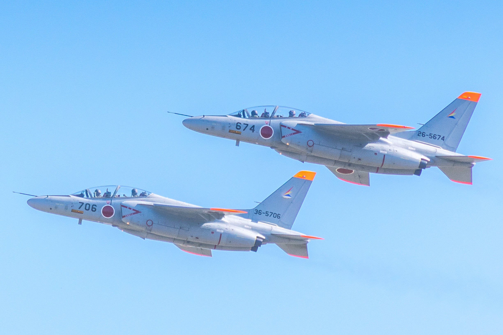

# 概要

イメージにタグをつけるマシーン

# 前提条件

Microsoft Azure Compute Vision APIのキーを取得してください。

# 使い方

python3 computerVision.py "azure compute vision api key" "picture directry"

# 写真を読み込ませるとこんな感じで出力されます。

[読み込ませた画像]


```
{
    "requestId": "1459a2fd-8357-4e70-883a-6894eecabaa1",
    "metadata": {
        "width": 3000,
        "height": 2000,
        "format": "Jpeg"
    },
    "description": {
        "captions": [
            {
                "text": "a fighter jet flying through a blue sky",
                "confidence": 0.8898904948822559
            }
        ],
        "tags": [
            "outdoor",
            "plane",
            "flying",
            "fighter",
            "air",
            "airplane",
            "transport",
            "aircraft",
            "smoke",
            "jet",
            "military",
            "blue",
            "gray",
            "high",
            "large",
            "silver",
            "red",
            "clear"
        ]
    },
    "color": {
        "dominantColorForeground": "Grey",
        "accentColor": "CA5201",
        "isBwImg": false,
        "dominantColors": [],
        "dominantColorBackground": "Grey"
    },
    "categories": [
        {
            "score": 0.97265625,
            "name": "sky_object"
        }
    ]
}
"a fighter jet flying through a blue sky"
[
    "outdoor",
    "plane",
    "flying",
    "fighter",
    "air",
    "airplane",
    "transport",
    "aircraft",
    "smoke",
    "jet",
    "military",
    "blue",
    "gray",
    "high",
    "large",
    "silver",
    "red",
    "clear"
]
"sky_object"

```